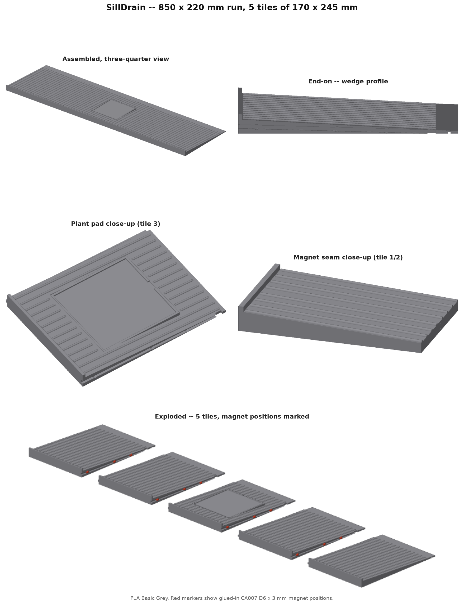
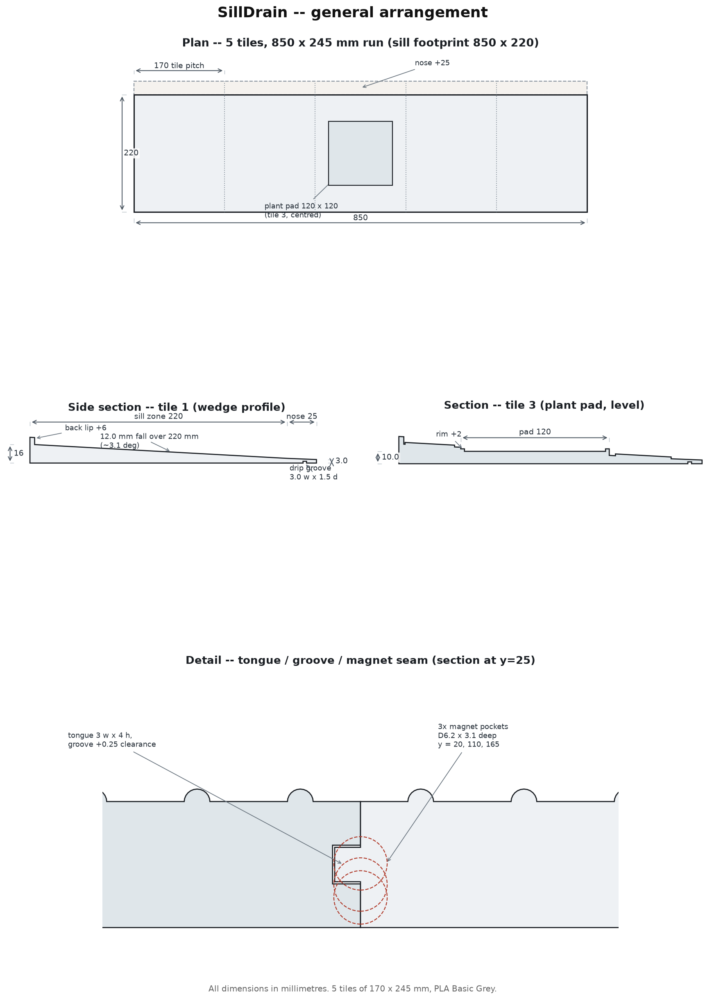

# SillDrain

## Why this exists

The bathroom window sill (850 x 220 mm) sits directly above the bath, and
water and soap that land on it just pool there or dribble down the wall
below rather than draining into the tub. SillDrain is a wedge-profiled board
that sits on the sill, falls gently from the window towards the bath, and
overhangs the sill's front edge so run-off drops clear into the water rather
than tracking down the wall. A ribbed top -- inspired by a silicone sink
draining mat -- channels the flow forward, and a flat, rimmed pad in the
centre tile gives a level spot for a plant pot.

The sill is far bigger than the printer bed (256 x 256 x 256 mm), so the run
is split into 5 identical tiles, aligned edge to edge with a
tongue-and-groove key and pulled together with glued-in CA007 D6 x 3 mm
magnets.

Everything below is generated from the model itself, so the numbers match
the files in this folder.



## Dimensions

| | Value |
|---|---|
| Overall run | 850 x 220 mm (5 x 170 mm tiles) |
| Tile, as printed | 170 x 245 mm (220 mm on the sill + 25 mm nose) |
| Thickness | 16 mm at the back, 4 mm at the sill edge, 3.0 mm at the drip tip |
| Fall | 12 mm over 220 mm, about 3.1 degrees |
| Plant pad | 120 x 120 mm, level, tile 3 of 5 |
| Total material | 2,006 cm3 across 5 tiles |



## Features

- **Wedge profile.** Flat underside so it sits flush on the level sill; the
  top falls 12 mm over the 220 mm sill depth (~3.1 degrees),
  enough to move water and soap without a visible tilt.
- **Back lip.** A 6 mm upstand over the first 4 mm keeps water
  from creeping back behind the board towards the window frame.
- **Front drip nose.** 25 mm cantilevered past the sill's own front edge,
  tapering to a 3.0 mm tip. A 3.0 x 1.5 mm undercut groove
  10 mm from the tip breaks the water film so it drips into the
  bath instead of tracking back along the underside to the wall.
- **Drain ribs.** Semicircular ribs (1.5 mm tall, 12 mm pitch) run down the
  slope, following it at every point rather than sitting flat-topped, to
  channel flow forward -- the same idea as a silicone sink mat.
- **Plant pad.** A level 120 x 120 mm pad set into the slope on tile
  3, with a 2 mm rim on 3 mm walls so a saucer can't slide off,
  and a 15 mm gap in the front rim so any overflow drains onto the
  ribbed surface rather than pooling.
- **Tongue and groove.** Every internal seam self-aligns: a 3 x 4 mm
  tongue on the left edge keys into a matching groove on the neighbour's
  right edge, cut 0.25 mm oversize per side for a sliding fit.
- **Magnets.** 3 pockets per seam (D6.2 x 3.1 mm, for a D6 x 3 mm magnet
  with a 0.1-0.2 mm glue fit), recessed into both mating faces at
  y = 20, 110, 165 mm, centred on the local mid-thickness at each
  position.

## Printing

| | |
|---|---|
| Printer | Bambu Lab A1, 0.4 nozzle |
| Layer | 0.20 mm |
| Material | PLA Basic Grey |
| Supports | None -- the 3MF sets `enable_support` to 0 |
| Orientation | Each tile flat, as modelled (z=0 is the underside) |
| Assembly | Tongue into groove, then glue a magnet into each of the 3 pockets per seam |

Files: `silldrain-v1-colour.3mf` carries all 5 tiles with a single
grey material slot, laid out with a visual gap (only one or two tiles fit the
A1 bed at once -- reposition in the slicer before each print).
`silldrain-tileN-v1.stl` is each tile separately. G-code is not generated
or kept here -- it is specific to the printer, filament and calibration
state, so slice it locally from the 3MF each time.

## Checks run at build time

| Tile | Volume (cm3) | Closed, one body | Body count |
|---|---|---|---|
| 1 | 399.0 | True | 1 |
| 2 | 401.3 | True | 1 |
| 3 | 399.7 | True | 1 |
| 4 | 401.3 | True | 1 |
| 5 | 404.5 | True | 1 |

| Check | Result |
|---|---|
| Shipped 3MF vs model volume | match (max delta 0.400 mm3) |

Mesh volumes are compared to 0.1 mm3, not the triangle count: the boolean
library tessellates flat regions a few triangles differently between runs,
which changes how the shape is written down and not the shape itself.
`make verify` rebuilds this revision and checks it.

## Repository layout

```
.                              latest revision, aliased in the root (after `make v1`)
├── README.md                  this file (regenerated every revision)
├── CLAUDE.md                  working rules for the project
├── LICENSE                    CERN-OHL-S v2
├── Makefile                   make vNN -- build and ship in one step
├── requirements.txt           pinned build dependencies
├── revisions/                 every version, exactly as shipped
│   └── vNN/                   deliverables + geometry.py it was built from
└── src/                       the generator
    ├── geomNN.py               the model -- all parameters live here
    ├── render.py                z-buffer renderer for the product views
    ├── build.py                 one command: renders, schematic, README, 3MF, STLs
    ├── ship.py                  copies a build into revisions/ and the root
    └── verify.py                rebuilds a revision and diffs it against shipped
```

Build everything from the model, where NN is the revision:

```
make build-vNN     # build only, into build/vNN -- ships nothing
make vNN            # build, then ship into revisions/vNN and the root aliases
```

## Licence

CERN Open Hardware Licence Version 2 -- Strongly Reciprocal (CERN-OHL-S v2).
The full text is in [LICENSE](LICENSE).

You may use, make, modify and sell this design. If you distribute a modified
version -- as files or as printed parts -- the licence requires you to release
your modified source under CERN-OHL-S v2 as well, and to state what you
changed.

## Revisions

| Version | Change |
|---|---|
| v1 | first revision -- geometry and renders only, for sign-off before the STL/3MF are treated as final |
