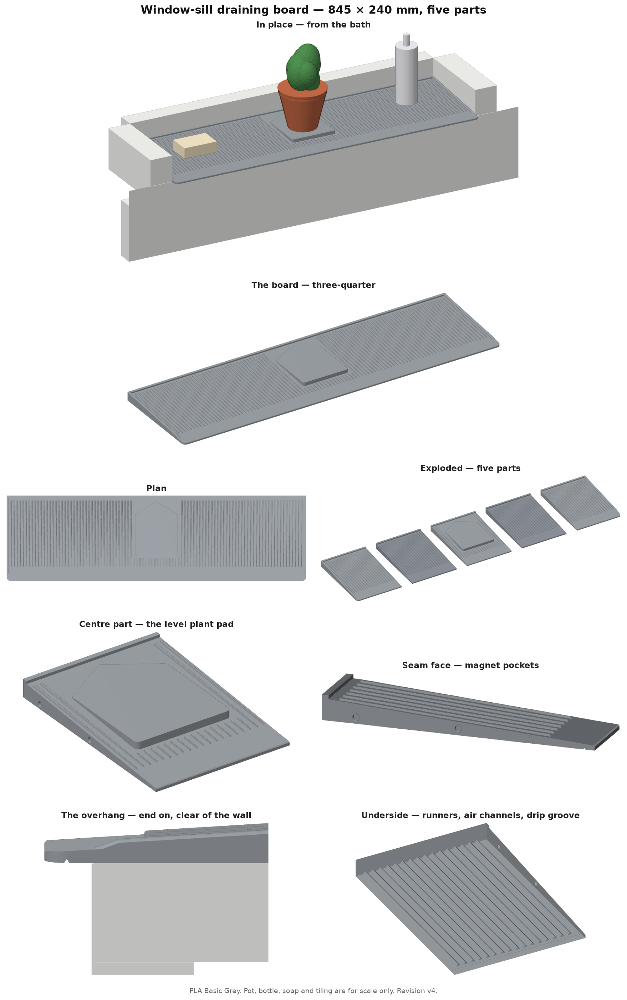
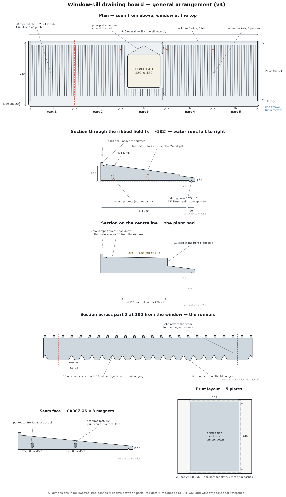
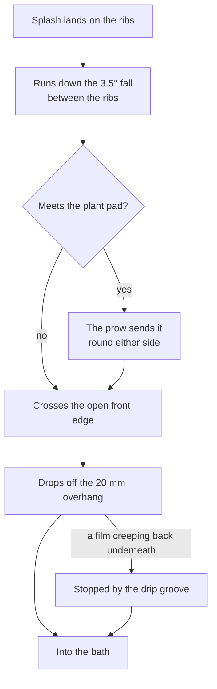

# Window-sill draining board

## Why this exists

Water and soap collect on the bathroom window sill above the bath, then dribble
down the wall. I wanted a draining board that fits the sill exactly, sends
everything into the bath instead, and gives the plant a level place to sit — in
the style of the silicone draining mat we already have in the kitchen.

## What it is

A ribbed draining board for an 845 × 220 mm tiled sill, printed in
5 parts on a Bambu Lab A1 and held together with magnets. The top falls
3.5° towards the bath and runs 20 mm past the sill edge, so
run-off drops into the bath rather than down the wall. A level
120 × 120 mm pad in the middle takes a plant pot.

Everything below is generated from the model itself, so the numbers match the
files in this folder.



## Dimensions

| | |
|---|---|
| Overall | 845 wide × 240 deep (220 on the sill + 20 overhang) |
| Thickness | 19.0 at the window, 4.3 at the front edge |
| Fall | 3.5° — 14.7 mm over the depth |
| Plant pad | 120 × 120, level, top at 17.5 — 50 from the window, 50 from the sill edge |
| Rims | 6 wide, 3 above the surface, back and both ends; front open |
| Ribs | 98, tapering 3.2 → 1.2 wide, 1.6 tall, 8.45 pitch |

| Part | Size (mm) | Material |
|---|---|---|
| Part 1 — left end | 169 × 240 × 22 | 455 cm³ |
| Part 2 — middle | 169 × 240 × 22 | 452 cm³ |
| Part 3 — centre, plant pad | 169 × 240 × 22 | 528 cm³ |
| Part 4 — middle | 169 × 240 × 22 | 452 cm³ |
| Part 5 — right end | 169 × 240 × 22 | 455 cm³ |

Total 2,343 cm³ of solid model; the printed weight depends on the
infill, so read it from the slicer.



## How it goes together


Part 1 is the left end as you stand in the bath facing the window.

## How water leaves it



## Features

- **Tapered ribs** running downhill, 3.2 mm at the back narrowing to
  1.2 mm, like the kitchen mat. Bottles and soap sit on the rib tops, out
  of the water. The seams between parts always fall midway between two ribs.
- **Level plant pad** with a prow behind it. Water running down the slope meets
  the prow's two angled faces and is steered round the pad instead of ponding
  against it.
- **Drip groove** — a 3.2 × 1.6 mm V under the overhang,
  11 mm past the sill edge. Any water creeping back along the
  underside drops off there instead of reaching the wall.
- **Runners and air channels underneath.** The sill is ridged split-face tile,
  and its grooves run along the sill, so a flat base would hold water in them
  where it could never dry. Instead the board stands on 3.6 mm
  runners with 16 channels per part between them, 6.0 wide and
  3.0 tall, running from the window to just past the wall face. The
  channel roofs are 45° gables, so they print without support.
- **Magnets, not glue, between parts.** 16 CA007
  Ø6 × 3 mm magnets in teardrop pockets, two pairs per seam, so the
  board lifts apart for cleaning.
- **No seam under the pot.** 5 parts, the centre one carrying the whole pad.

## Printing

| | |
|---|---|
| Printer | Bambu Lab A1 0.4 nozzle |
| Process | 0.20mm Standard @BBL A1, changed: sparse_infill_density |
| Layer | 0.20 mm |
| Walls | 2 loops |
| Infill | 10% grid |
| Material | Bambu PLA Basic @BBL A1, grey |
| Supports | none |
| Brim | auto brim (the slicer decides) |
| Orientation | Flat, runners down, as laid out in the 3MF |
| Plates | 5, one part each — the largest part is 240 mm on a 256 mm bed |

Print part 1 first and try it on the sill before printing the rest: it checks
the fit against the reveal and over the front edge trim.

Files: `windowsill.3mf` is a Bambu Studio project with all 5 parts, one per
plate, and the settings above already in it. Open it, pick a plate, slice and
print. When sending, map the part to the slot holding your grey filament: the
project assigns everything to filament 1.

**Don't save over `windowsill.3mf`.** Bambu Studio saves the project back to
the file it opened, replacing these settings with whatever the app has loaded
at the time. If you want to keep your own changes, use Save As to another name.
`windowsill-part1.stl` … `windowsill-part5.stl` are the same geometry separately.

## Fitting the magnets

Each seam face has two pockets, Ø6.2 × 3.2 mm deep, so a magnet sits
flush or just below the face. Polarity matters: every magnet in a **right-hand**
end must show the same pole outward, and every magnet in a **left-hand** end the
opposite pole, so any part mates with its neighbour.

1. Stack all 16 magnets into one column and mark the top face of the
   stack with a pen. Take them off one at a time without flipping them.
2. **Right-hand ends** (parts 1–4): glue each magnet in **marked face out**.
3. **Left-hand ends** (parts 2–5): glue each magnet in **marked face in**.
4. Before the glue sets, offer each pair of parts together — they should pull
   in, not push apart. Fix a flipped magnet now; it is much harder later.

Use a gel superglue (CA), a small drop in the pocket, and keep glue off the
seam faces.

## Care

Wipe it down with warm water and let it dry. Every so often, lift the parts
apart, rinse them and wipe the sill underneath. Keep the water warm rather than
hot — PLA starts to soften around 55–60 °C, so no dishwasher. The window gets
no direct sun, so PLA is fine here; on a sunny sill, print it in PETG or ASA
instead.

## Checks run at build time

| Check | Result |
|---|---|
| part 1 · closed mesh, one body | 455.4 cm³ |
| part 2 · closed mesh, one body | 452.2 cm³ |
| part 3 · closed mesh, one body | 528.1 cm³ |
| part 4 · closed mesh, one body | 452.2 cm³ |
| part 5 · closed mesh, one body | 455.4 cm³ |
| largest part + brim vs A1 bed | 250.0 of 256 |
| parts side by side | 845.00 (model 845.0) |
| overlap between neighbours | 0.000 mm³ |
| magnet pocket cover, top / bottom | 1.88 / 2.30 mm |
| solid between channel and pocket | 6.3 mm |
| cover over channel at its front end | 2.24 mm |
| channel end to drip groove | 4.4 mm |
| tip thickness | 4.32 mm |
| shipped 3MF vs model volume | 5 objects, 2343.4 vs 2343.4 cm³ |
| shipped STLs vs model volume | 2343.4 vs 2343.4 cm³ |

Mesh volumes are compared, not triangle counts: the boolean and hull
libraries tessellate flat regions a few triangles differently between
versions, which changes how the shape is written down and not the shape
itself. `make verify` rebuilds this revision and checks it.

## Repository layout

```
.                             latest revision, aliased in the root
├── README.md                 this file (regenerated every revision)
├── CLAUDE.md                 working rules for the project
├── LICENSE                   CERN-OHL-S v2
├── Makefile                  make vNN — build and ship in one step
├── requirements.txt          pinned build dependencies
├── views.png  schematic.png  latest renders
├── windowsill.3mf            latest, all parts, one per plate
├── windowsill-part1.stl
├── windowsill-part2.stl
├── windowsill-part3.stl
├── windowsill-part4.stl
├── windowsill-part5.stl
├── revisions/                every shipped version, exactly as shipped
│   └── vNN/                  deliverables + geometry.py it was built from
├── alt/silldrain/            a parallel design, set aside — not printed
└── src/                      the generator
    ├── geomNN.py             the model — all parameters live here
    ├── render.py             z-buffer renderer for the views
    ├── build.py              one command: views, schematic, README, 3MF, STLs
    ├── ship.py               copies a build into revisions/ and the root
    └── verify.py             rebuilds a revision and diffs it against shipped
```

Build everything from the model, where NN is the revision:

```
make vNN
```

which is `python3 src/build.py geomNN vNN` followed by the copy into
`revisions/vNN/` and the root. G-code is not kept here — it is tied to the
printer, filament and calibration state, so slice it locally from the 3MF.

## Licence

CERN Open Hardware Licence Version 2 — Strongly Reciprocal (CERN-OHL-S v2).
The full text is in [LICENSE](LICENSE).

You may use, make, modify and sell this design. If you distribute a modified
version — as files or as printed parts — the licence requires you to release
your modified source under CERN-OHL-S v2 as well, and to state what you
changed. Modified designs therefore stay publicly available.

## Revisions

| Version | Change |
|---|---|
| v1 | concept only, never shipped: 848 wide, 2.5° fall, flat base |
| v2 | first shipped: 845 wide to the re-measured sill, 3.5° fall, underside runners with air channels for the ridged tile, front magnet pockets moved back to keep 1.6 mm cover. Its 3MF opens with every part off the bed — use v3 |
| v3 | geometry unchanged from v2; the 3MF is now a Bambu Studio project, one part per plate. Its 4 walls and 5 mm brim were reset to stock when the project was opened in the app |
| v4 | geometry unchanged; print settings are stock 0.20mm Standard with 10% infill instead of 15%, declared as a change so the app keeps it |
